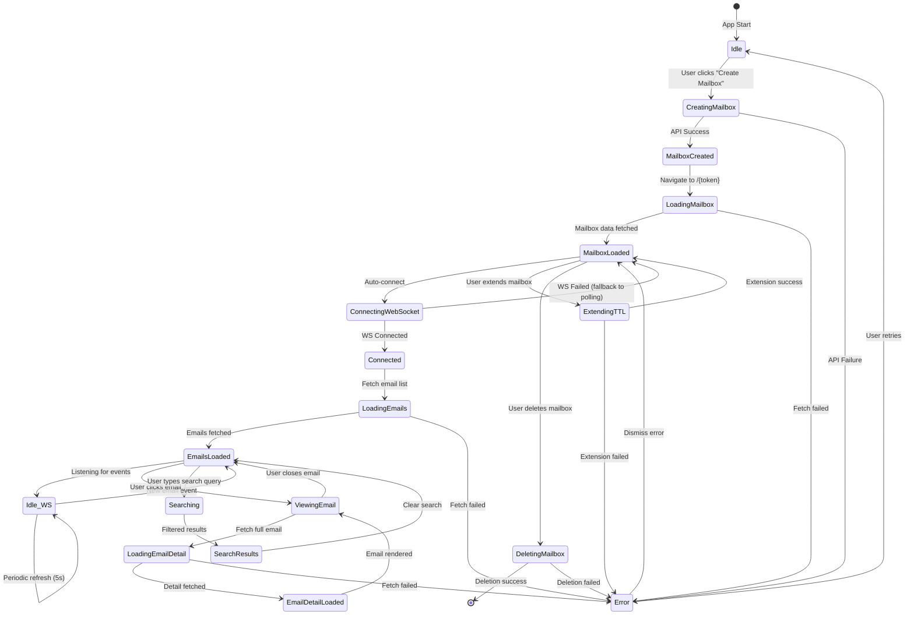
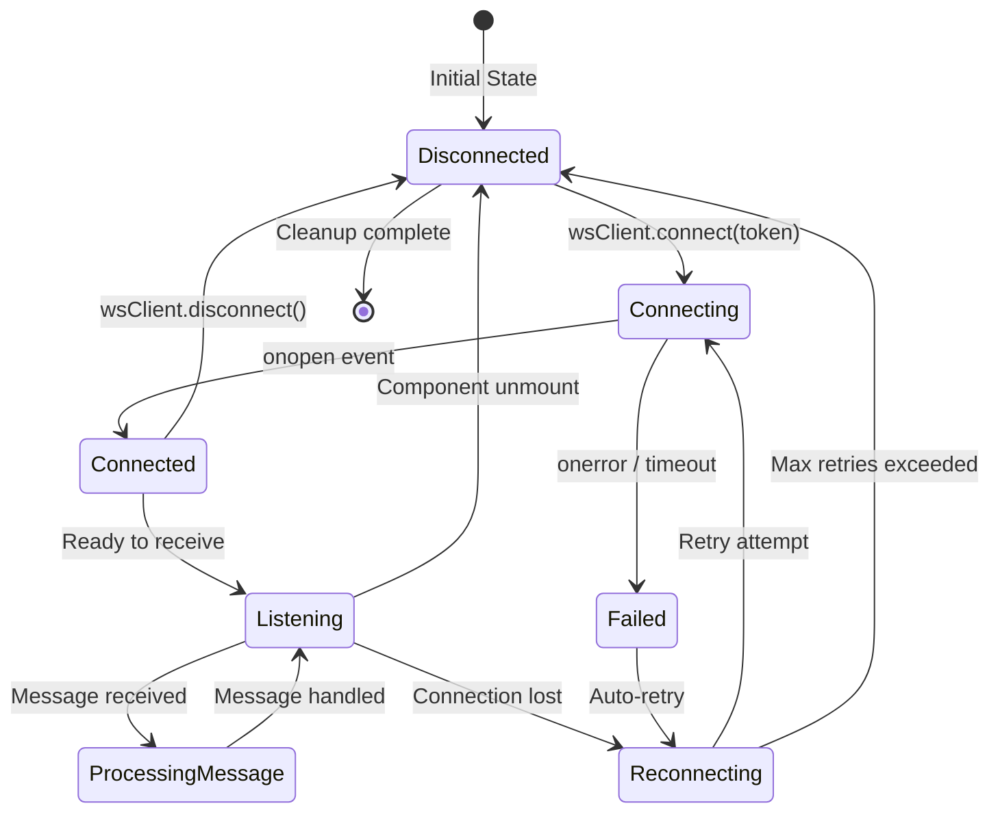
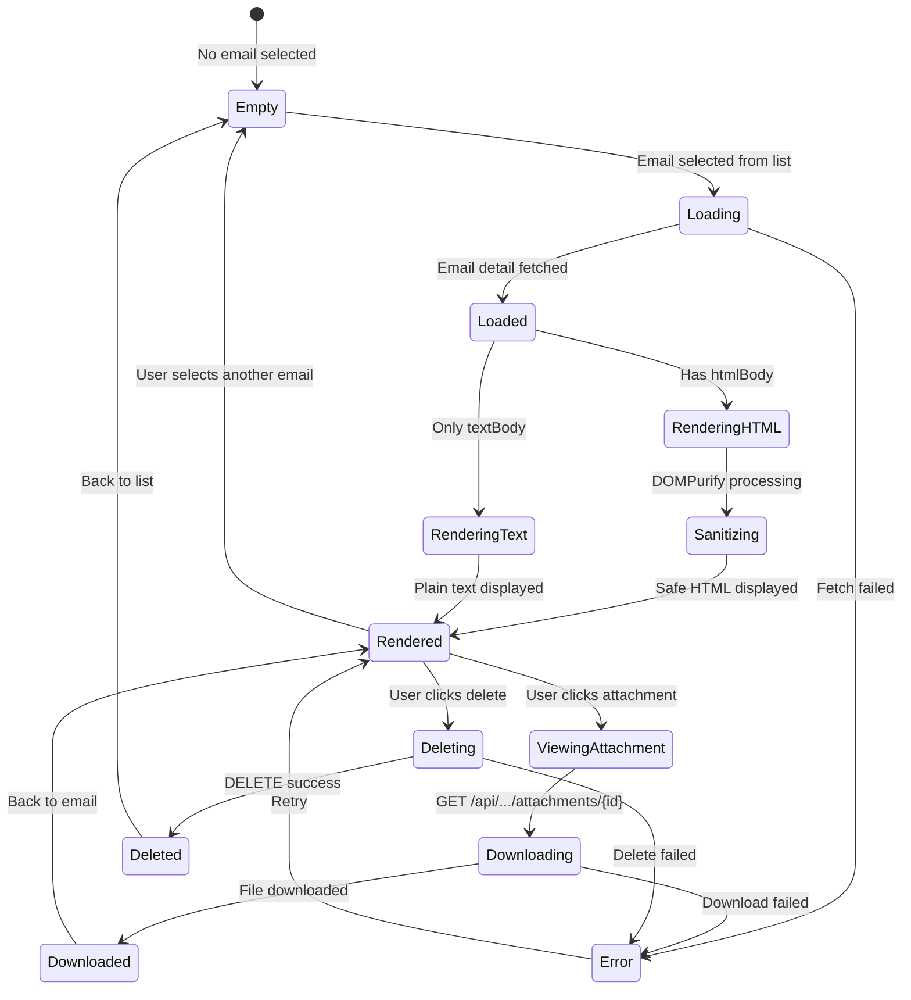
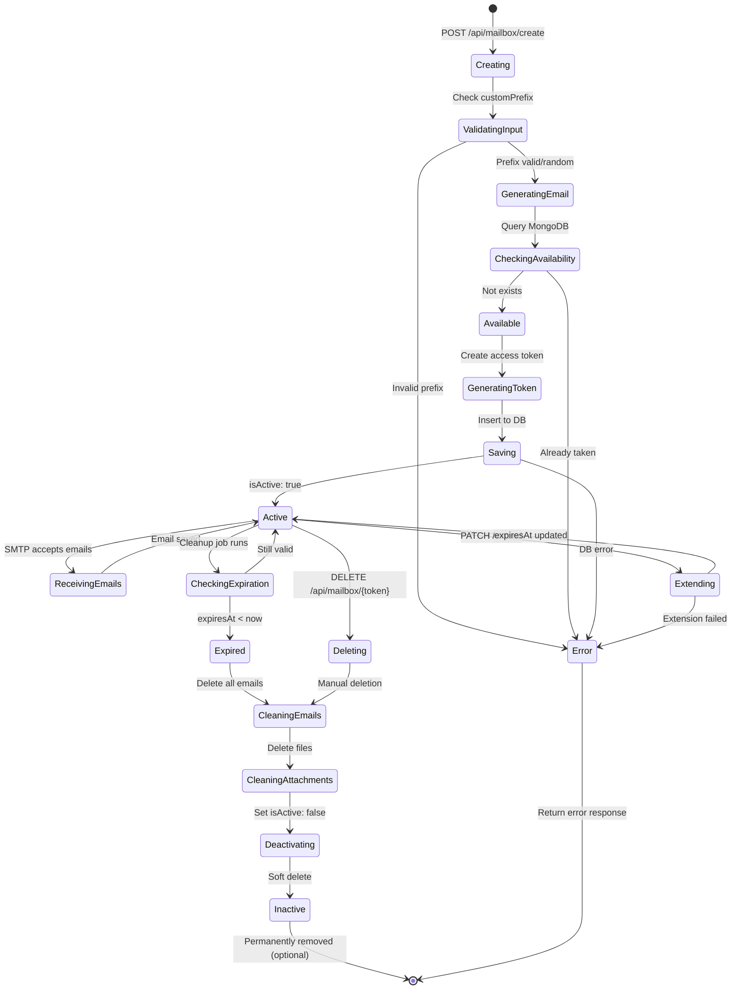
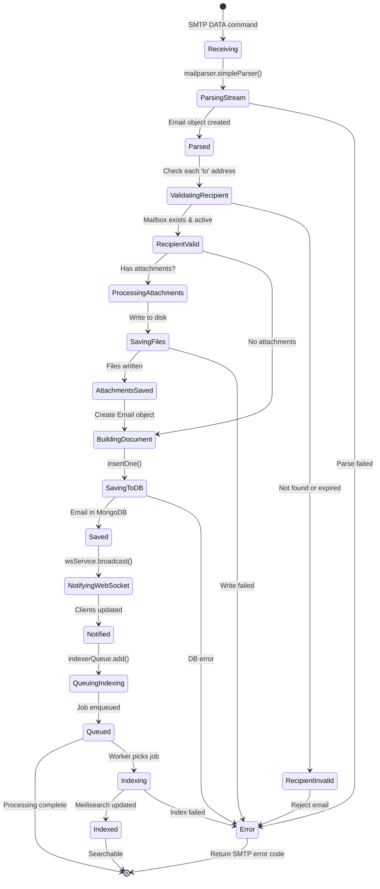
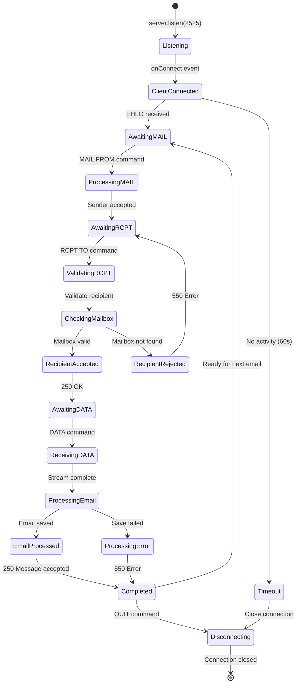
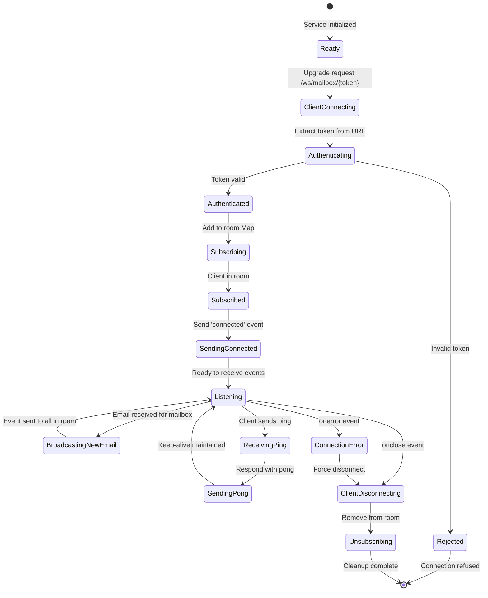
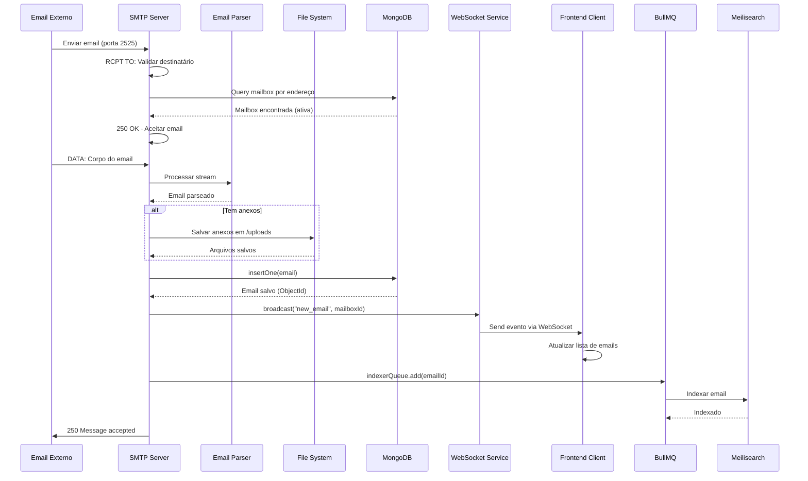

# 🔄 Diagramas de Máquina de Estados - TempMail

## 📋 Índice
- [Frontend - Mailbox Store](#frontend---mailbox-store)
- [Frontend - WebSocket Connection](#frontend---websocket-connection)
- [Frontend - Email Viewer](#frontend---email-viewer)
- [Backend - Mailbox Lifecycle](#backend---mailbox-lifecycle)
- [Backend - Email Processing](#backend---email-processing)
- [Backend - SMTP Server](#backend---smtp-server)
- [Backend - WebSocket Service](#backend---websocket-service)

---

## Frontend - Mailbox Store

**Estados:**
- `Idle`: Nenhuma ação em andamento
- `CreatingMailbox`: POST /api/mailbox/create
- `MailboxCreated`: Token recebido, redirecionando
- `LoadingMailbox`: GET /api/mailbox/{token}
- `MailboxLoaded`: Dados da mailbox carregados
- `ConnectingWebSocket`: Estabelecendo conexão WS
- `Connected`: WebSocket ativo
- `LoadingEmails`: GET /api/mailbox/{token}/emails
- `EmailsLoaded`: Lista de emails em memória
- `ViewingEmail`: Email selecionado
- `LoadingEmailDetail`: GET /api/mailbox/{token}/emails/{id}
- `EmailDetailLoaded`: Detalhes completos carregados
- `Searching`: Filtrando emails localmente
- `SearchResults`: Resultados da busca exibidos
- `ExtendingTTL`: PATCH /api/mailbox/{token}/extend
- `DeletingMailbox`: DELETE /api/mailbox/{token}
- `Error`: Erro ocorreu, exibindo mensagem

---

## Frontend - WebSocket Connection

**Eventos:**
- `onopen`: WebSocket conectado
- `onmessage`: Nova mensagem recebida
  - `type: "connected"` → Recarregar emails
  - `type: "new_email"` → Atualizar lista
- `onerror`: Erro de conexão
- `onclose`: Conexão fechada
- Auto-reconnect: 3 tentativas com backoff

---

## Frontend - Email Viewer

**Estados:**
- `Empty`: Nenhum email selecionado (placeholder exibido)
- `Loading`: Buscando detalhes do email
- `Loaded`: Dados recebidos, processando
- `RenderingHTML`: Preparando HTML para exibição
- `Sanitizing`: Removendo scripts/XSS
- `RenderingText`: Formatando texto plano
- `Rendered`: Email totalmente exibido
- `ViewingAttachment`: Modal/preview de anexo
- `Downloading`: Download em progresso
- `Downloaded`: Arquivo salvo
- `Deleting`: Removendo email
- `Deleted`: Email removido com sucesso

---

## Backend - Mailbox Lifecycle

**Estados:**
- `Creating`: Processando requisição de criação
- `ValidatingInput`: Zod validation
- `GeneratingEmail`: Criar endereço (random ou custom)
- `CheckingAvailability`: Verificar se já existe
- `Available`: Email disponível
- `GeneratingToken`: Criar token único (32 bytes hex)
- `Saving`: Inserir documento no MongoDB
- `Active`: Mailbox operacional (isActive: true)
- `ReceivingEmails`: Aceitando emails via SMTP
- `Extending`: Aumentando TTL
- `CheckingExpiration`: Verificação periódica (10min)
- `Expired`: TTL ultrapassado
- `CleaningEmails`: Deletando documentos da collection 'emails'
- `CleaningAttachments`: Removendo arquivos físicos
- `Deactivating`: Marcando isActive: false
- `Inactive`: Não aceita mais emails
- `Deleting`: Remoção manual pelo usuário

---

## Backend - Email Processing

**Estados:**
- `Receiving`: Recebendo stream de dados do SMTP
- `ParsingStream`: Convertendo raw email em objeto
- `Parsed`: Email parseado com sucesso
- `ValidatingRecipient`: Verificar se mailbox existe
- `RecipientValid`: Destinatário válido
- `RecipientInvalid`: Rejeitar email
- `ProcessingAttachments`: Detectar anexos
- `SavingFiles`: Gravar em `/uploads/{mailboxId}/{filename}`
- `AttachmentsSaved`: Arquivos persistidos
- `BuildingDocument`: Criar objeto Email
- `SavingToDB`: Inserir no MongoDB
- `Saved`: Email armazenado
- `NotifyingWebSocket`: Enviar evento para clientes conectados
- `Notified`: WebSocket broadcast enviado
- `QueuingIndexing`: Adicionar job BullMQ
- `Queued`: Job na fila
- `Indexing`: Worker processando
- `Indexed`: Email no Meilisearch

---

## Backend - SMTP Server

**Estados:**
- `Listening`: Aguardando conexões na porta 2525
- `ClientConnected`: Cliente SMTP conectado
- `AwaitingMAIL`: Esperando MAIL FROM
- `ProcessingMAIL`: Validando remetente
- `AwaitingRCPT`: Esperando RCPT TO
- `ValidatingRCPT`: Verificando destinatário
- `CheckingMailbox`: Query no MongoDB
- `RecipientAccepted`: Destinatário OK (250)
- `RecipientRejected`: Destinatário inválido (550)
- `AwaitingDATA`: Esperando DATA
- `ReceivingDATA`: Recebendo corpo do email
- `ProcessingEmail`: Parsear e salvar
- `EmailProcessed`: Sucesso
- `ProcessingError`: Erro ao processar
- `Completed`: Transação finalizada
- `Timeout`: Inatividade detectada
- `Disconnecting`: Encerrando conexão

---

## Backend - WebSocket Service

**Estados:**
- `Ready`: WebSocket service pronto
- `ClientConnecting`: Cliente solicitando upgrade
- `Authenticating`: Validar token no URL
- `Authenticated`: Token corresponde a mailbox válida
- `Rejected`: Token inválido ou expirado
- `Subscribing`: Adicionar à sala (`Map<token, Set<WebSocket>>`)
- `Subscribed`: Cliente registrado
- `SendingConnected`: Enviar confirmação de conexão
- `Listening`: Aguardando eventos
- `BroadcastingNewEmail`: Notificar todos clientes da sala
- `ReceivingPing`: Heartbeat do cliente
- `SendingPong`: Responder heartbeat
- `ClientDisconnecting`: Cliente desconectou
- `Unsubscribing`: Remover da sala
- `ConnectionError`: Erro de comunicação

---

## 🔄 Fluxo Completo: Recebimento de Email

---

## 📊 Resumo dos Estados por Componente

| Componente | Total de Estados | Estados Principais |
|------------|------------------|-------------------|
| **Mailbox Store (Frontend)** | 15 | Idle, LoadingEmails, Connected, ViewingEmail |
| **WebSocket Client (Frontend)** | 6 | Disconnected, Connecting, Connected, Listening |
| **Email Viewer (Frontend)** | 10 | Empty, Loading, Rendered, Downloading |
| **Mailbox Lifecycle (Backend)** | 13 | Creating, Active, Expired, Inactive |
| **Email Processing (Backend)** | 14 | Receiving, Parsed, Saved, Indexed |
| **SMTP Server (Backend)** | 11 | Listening, ValidatingRCPT, ProcessingEmail |
| **WebSocket Service (Backend)** | 10 | Ready, Subscribed, Broadcasting |

---

## 🎯 Transições Críticas

### Alta Frequência
- `Listening → ProcessingMessage` (WebSocket Frontend)
- `ReceivingEmails → Active` (Mailbox Backend)
- `Listening → BroadcastingNewEmail` (WebSocket Backend)

### Alta Importância
- `CheckingMailbox → RecipientRejected` (SMTP - previne spam)
- `Active → Expired` (Cleanup - libera recursos)
- `Parsed → ValidatingRecipient` (Email Processing - segurança)

### Pontos de Falha
- `SavingToDB → Error` (MongoDB indisponível)
- `Connecting → Failed` (WebSocket não conecta)
- `Downloading → Error` (Anexo corrompido/não encontrado)

---

## 🔧 Melhorias Sugeridas

1. **Circuit Breaker**: Adicionar estado `CircuitOpen` para falhas repetidas
2. **Retry Logic**: Estado `Retrying` com backoff exponencial
3. **Rate Limiting**: Estado `RateLimited` para proteger API
4. **Health Checks**: Estado `Degraded` quando serviços externos falham
5. **Graceful Degradation**: Fallback para polling quando WebSocket falha

---

## 📝 Notas Técnicas

- **Frontend**: Utiliza Zustand para gerenciar estados complexos
- **Backend**: Estados são implícitos (async/await), não máquinas de estado explícitas
- **Transições assíncronas**: Maioria das transições envolve I/O (network, disk, database)
- **Idempotência**: Algumas operações (criação de mailbox) não são idempotentes
- **Consistência eventual**: WebSocket pode falhar, mas polling garante atualização
